# 💓 Heart Disease Prediction Web App

## 💡 Overview
This Streamlit app performs heart disease prediction using three machine learning models:
- **K-Nearest Neighbors (KNN)**
- **Logistic Regression**
- **Support Vector Machine (SVM)**

It includes preprocessing, outlier removal, SMOTE balancing, visualization, model training, and comparison.

---

## 🚀 How to Run

### 1. Install Required Libraries
Make sure Python (version 3.7+) is installed.

Then install all required libraries:

```bash
pip install streamlit pandas scikit-learn seaborn matplotlib imbalanced-learn plotly
```

---

### 2. File Setup
Make sure the following files are in the same folder:
- `AI_Machine_Learning.py` ✅ *(Main app code)*
- `heart.csv` ✅ *(Dataset used in the app)*

---

### 3. Start the App
In your terminal or command prompt, run:

```bash
streamlit run AI_Machine_Learning.py
```

This will launch the web app in your browser. If it doesn't open automatically, copy and paste the link provided in the terminal.

---

## 🧭 App Structure

| Tab | Description |
|-----|-------------|
| **1. Preprocessing & EDA** | Displays dataset preview, summary stats, outlier/missing data removal. |
| **2. Logistic Regression** | Trains and evaluates a logistic regression model. |
| **3. KNN** | Searches for best K value and evaluates KNN. |
| **4. SVM** | Trains SVM models (linear & RBF), shows decision boundaries. |
| **5. Model Comparison** | Compares all models with charts and metrics. |

---

## 🛠️ Troubleshooting

- ❌ `ModuleNotFoundError`: Re-run the `pip install` command above.
- ❌ `FileNotFoundError`: Make sure `heart.csv` is in the same folder as your `.py` file.
- ❌ Browser not opening: Copy and paste the `localhost` link Streamlit shows into your browser.


## Workflow

## Data Preparation
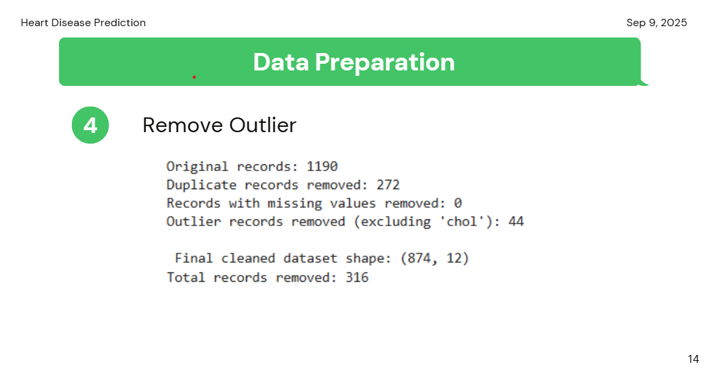
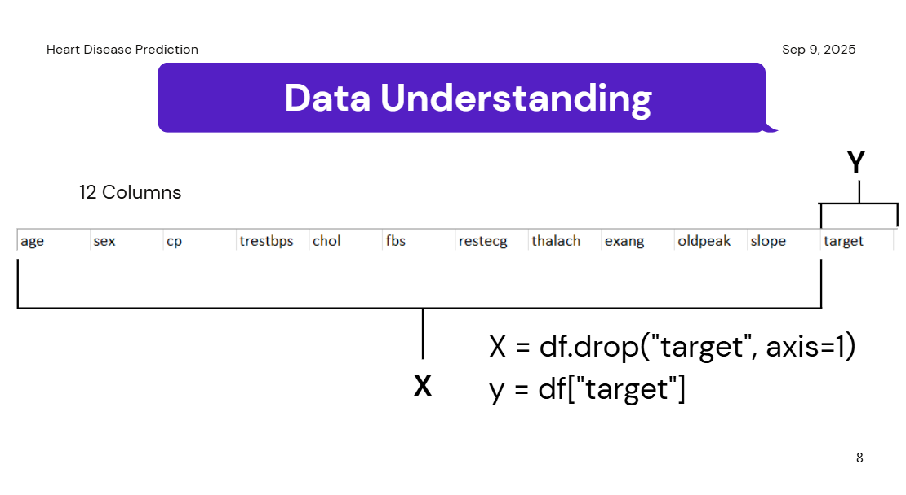

## Models
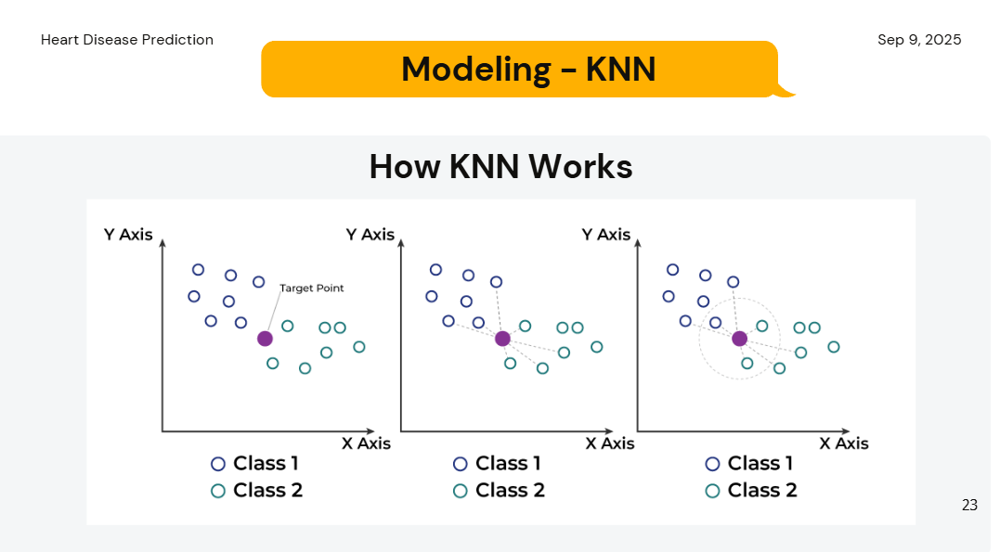
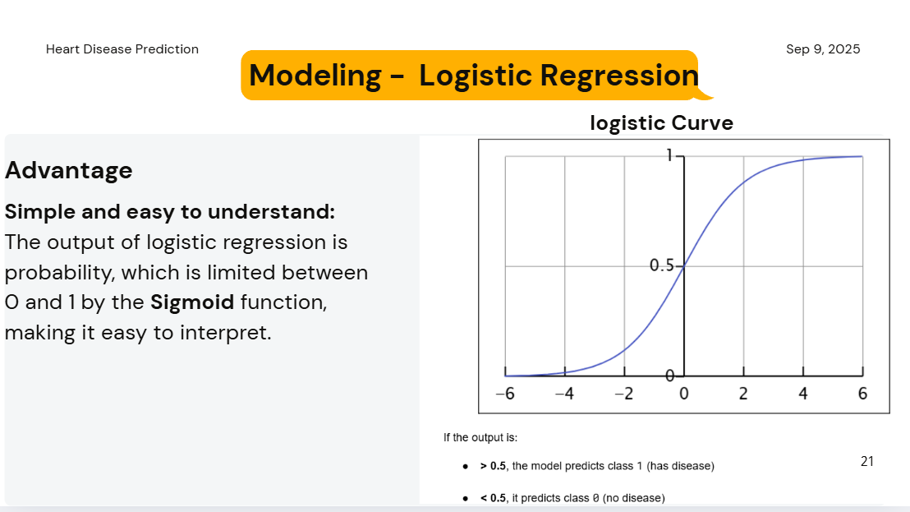
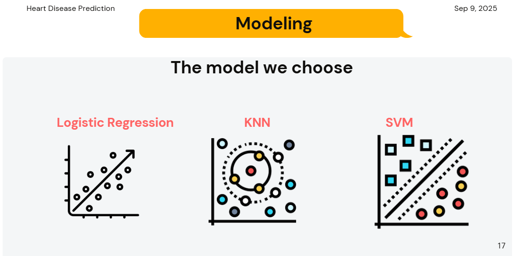

## SVM Models
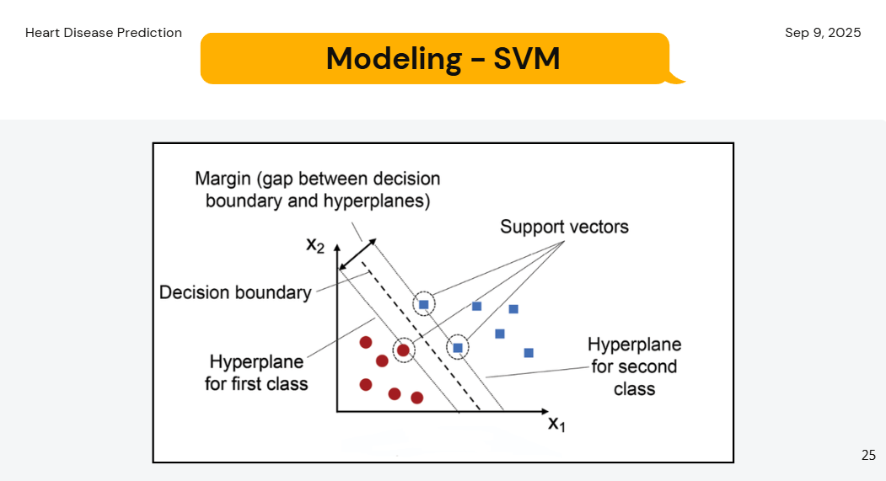
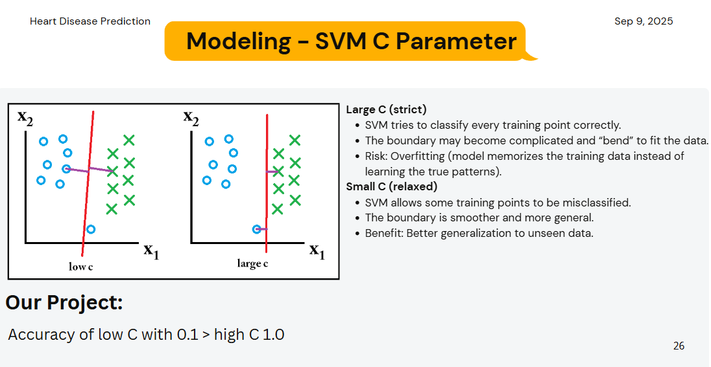
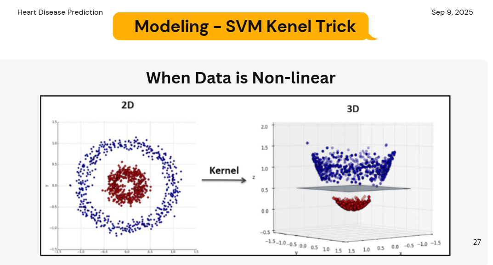

## Dataset Split
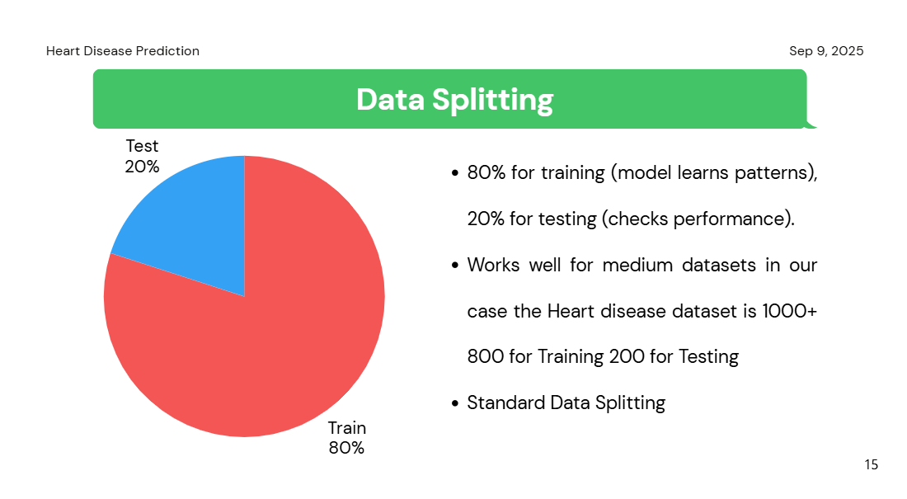

## Analysis
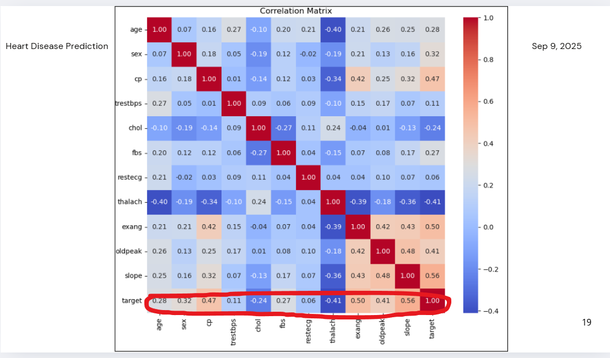


## Final Result
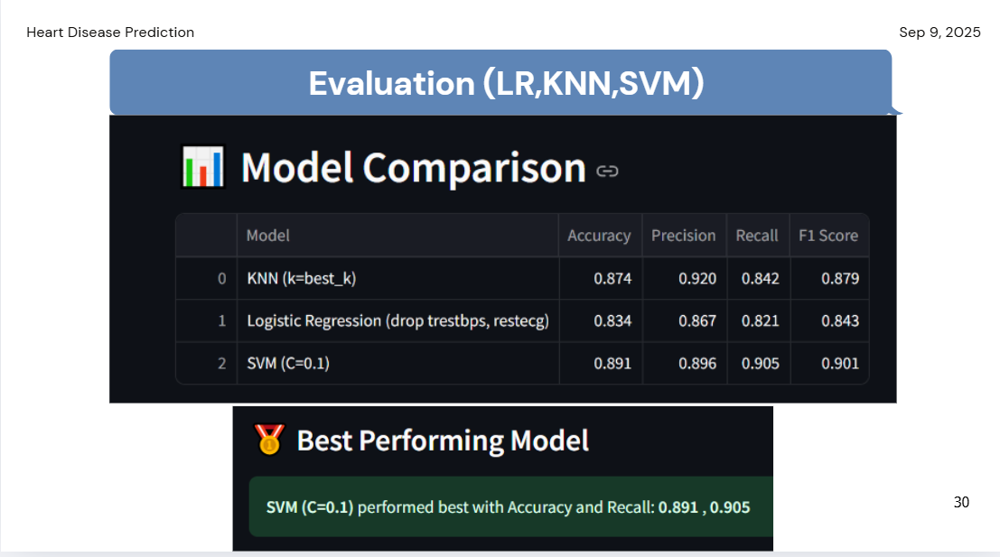


